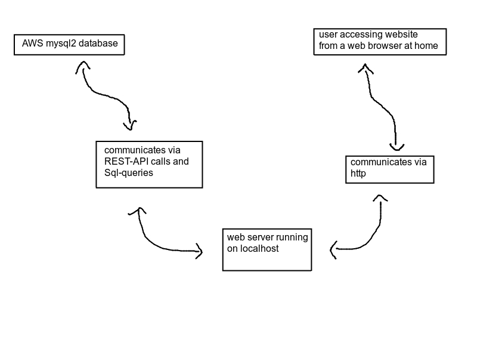
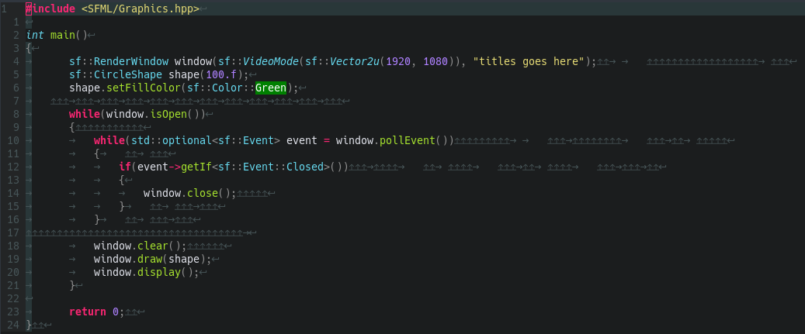
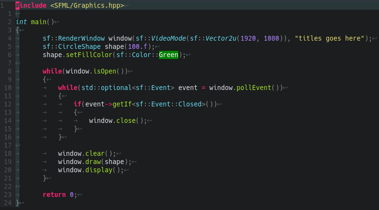

# StrongStart2025

> A spending tracker application for CS100 StrongStart2025 project

## Authors
- Federico (Mentor)
- Danish
- Eloy
- Jack
- Jinwoo

## Sections
- [Top of page](#strongstart2025)
- [Authors](#authors)
- [Sections](#sections)
- [Preview and screenshots](#preview)
- [Technical details](#technical-details)
- [Installation and running server on localhost](#running-server-on-localhost)
- [Scripts](#scripts)
    - [clearTrailingSpaces.bash](./scripts/clearTrailingSpaces.bash)
    - [mariadbCLI.bash](./scripts/mariadbCLI.bash)

## Preview


## Technical details

**Technologies used**
- languages
    - javaScript
    - html
    - css
- toolchain
    - node
    - npm
        - dotenv
        - express-js
        - mysql2
        - chai
        - jest
        - jest-environment-jsdom
    - bash
        - [clearTrailingSpaces.bash](./scripts/clearTrailingSpaces.bash)
        - [mariadbCLI.bash](./scripts/mariadbCLI.bash)
    - mariadb-clients
    - SQL (AWS mysql2 server)
- source control
    - git
    - github

**Backend/Frontend structure**



## Running server on localhost

1. Make sure you have `node` and `npm` installed on your machine

    On arch-linux based distros:
    ```shell
    sudo pacman -Syu nodejs npm
    ```


    On debian-linux based distros:
    ```shell
    sudo apt update && sudo apt install nodejs npm
    ```


    On linux systems with the dnf package manager:
    ```shell
    sudo dnf upgrade --refresh && sudo dnf install nodejs nodejs-npm
    ```


    On MacOS/OSX, assuming you have the [brew package manager](https://brew.sh/) installed, run:
    ```shell
    brew install node
    ```


    On Windows Devices, either visit the [nodejs download](https://nodejs.org/en/download) page,
    and run the installer, or install using `winget` on newer versions of Windows by running:
    ```powershell
    winget install -e --id OpenJS.NodeJS
    ```

2. Ensure `node` and `npm` are both in PATH environment variable after installation

    The following should yield some sort of output resembling a version number:
    ```shell
    node --version
    npm --version
    ```


    Example output:
    ```
    v24.8.0
    11.6.0
    ```

3. Clone the repository and cd into it

    > The following command should be run in the [git-bash](https://git-scm.com/install/windows) terminal for Windows
    ```shell
    git clone https://github.com/FNocioni/StrongStart2025 && cd StrongStart2025
    ```

4. Install server dependencies

    ```shell
    npm install
    ```


    Create a `.env` file in the project root and ensure that the correct credentials are in the file,
    in the following text format:
    ```
    DB_HOST=database_host_url_goes_here
    DB_USER=database_login_username_goes_here
    DB_PASS=database_login_password_goes_here
    DB_PORT=database_port_goes_here
    DB_NAME=database_default_database_target
    ```

5. Start the server

    ```shell
    npm start
    ```

6. Connect to localhost web server via browser

    On Linux, via chromium
    ```shell
    chromium 'http://localhost:5000'
    ```


    On any other OS, open a Modern web-browser and go to the url: <http://localhost:5000>

## Scripts
[clearTrailingSpaces.bash](./scripts/clearTrailingSpaces.bash)

This script is meant to be run in a linux environment

> Clear trailing spaces and tabs in passed file

If in project root, you run:
```shell
./scripts/clearTrailingSpaces.bash fileContainingTrailingSpacesGoesHere.cpp
```

An example file initally looking like:



Will look like the following after the script is ran:



[mariadbCLI.bash](./scripts/mariadbCLI.bash)

This script is meant to be run in a linux environment


If you are on WindowsOS, use a GUI tool such as [MySql Workbench]("https://dev.mysql.com/downloads/workbench/") instead


> Connect to MySql2 database with specified credentials in the project root ./.env file
> 
> Allows for fast logins to a MySql2 without having to type in credentials every single time


Resolve dependencies before running script:
```shell
sudo pacman -Syu mariadb-clients
```


Assuming that your ./.env file is properly populated with the correct information in the following text format:
```
DB_HOST=database_host_url_goes_here
DB_USER=database_login_username_goes_here
DB_PASS=database_login_password_goes_here
DB_PORT=database_port_goes_here
DB_NAME=database_default_database_target
```


You can simply run the following command from the project root:
```shell
./scripts/mariadbCLI.bash
```

Which will connect you to the specified MySql2 database in the ./.env file
